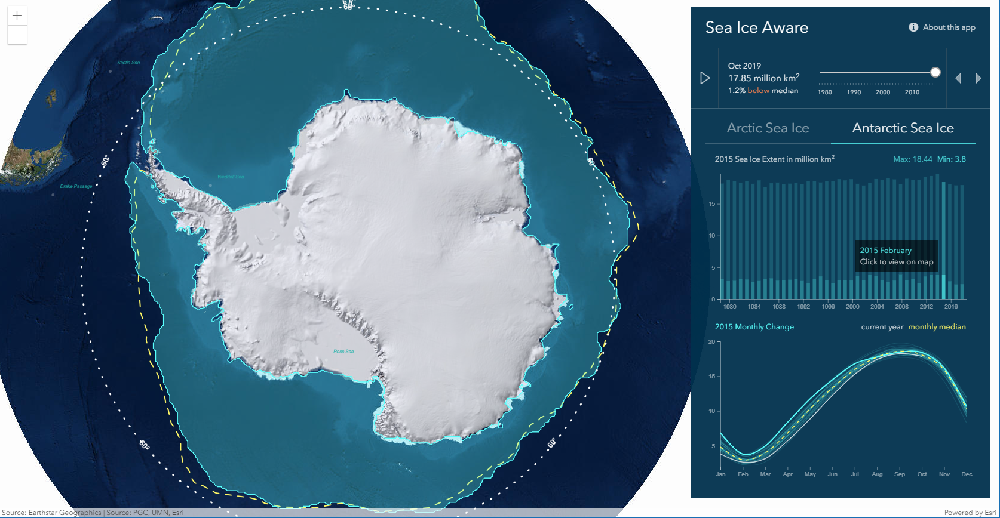

# Sea Ice
This app displays the monthly mean sea ice extent for the [Arctic](https://www.arcgis.com/home/item.html?id=d1fb8225058e4a0d96ead7b9a574a652) and [Antarctic](https://www.arcgis.com/home/item.html?id=e7f11116c0bc42fb8c7c4d1b1d70eceb) along with the historical median extent.

[View it live](https://livingatlas.arcgis.com/sea-ice/)



## Features

This app displays the monthly mean sea ice extent for the Arctic and Antarctic along with the historical median extent. Additionally, graphs are used to visualize the minimum and maximum extent for each year (top), and the monthly time series for each year (bottom). Use the top graph to select specific years to display in the map.

## Instructions

- Before we begin, make sure you have a fresh version of [Node.js](https://nodejs.org/en/) and NPM installed. The current Long Term Support (LTS) release is an ideal starting point. 

- To begin, clone this repository to your computer:

    ```sh
    https://github.com/vannizhang/sea-ice.git
    ```

- From the project's root directory, install the required packages (dependencies):

    ```sh
    npm install
    ```

 - Now you can start the webpack dev server to test the app on your local machine:

    ```sh
    # it will start a server instance and begin listening for connections from localhost on port 8080
    npm run start
    ```

 - To build/deploye the app, you can simply run:

    ```sh
    # it will place all files needed for deployment into the /dist directory 
    npm run build
    ```

## Resources
- [ArcGIS API for JavaScript (version 4.21)](https://developers.arcgis.com/javascript/index.html)
- [National Snow and Ice Data Center](https://nsidc.org/)
- [ArcGIS Living Atlas of the World](https://livingatlas.arcgis.com/en/browse/#d=2&q=sea%20ice)
- [D3.js](https://d3js.org/)

## Issues

Find a bug or want to request a new feature?  Please let us know by submitting an issue.

## Disclaimer

This demo application is for illustrative purposes only and it is not maintained. There is no support available for deployment or development of the application.

## Contributing

Esri welcomes contributions from anyone and everyone. Please see our [guidelines for contributing](https://github.com/esri/contributing).

## Licensing
Copyright 2019 Esri

Licensed under the Apache License, Version 2.0 (the "License");
you may not use this file except in compliance with the License.
You may obtain a copy of the License at

   http://www.apache.org/licenses/LICENSE-2.0

Unless required by applicable law or agreed to in writing, software
distributed under the License is distributed on an "AS IS" BASIS,
WITHOUT WARRANTIES OR CONDITIONS OF ANY KIND, either express or implied.
See the License for the specific language governing permissions and
limitations under the License.

A copy of the license is available in the repository's [LICENSE](license) file.
